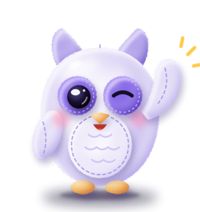

  

<h1 align="center">Owl Messenger</h1>

  <b>Уютный мессенджер с совой: тихие ночи, стикеры и приватность</b>

  

  
  
  
  

  
  
  
  
  
  

---

## 🦉 Что такое Owl

Owl — мессенджер, который работает прямо в браузере и ставится на экран «Домой» как обычное приложение. Без App Store и Google Play, без номера телефона: нужна только почта.

## ✨ Фишки

| | |
|---|---|
| 🌙 **Сова не будит** | Ночью уведомления молчат, утром приходит одна сводка: кто писал. Собеседник видит, что у вас ночь, а если очень нужно, отмечает сообщение «⚡ Срочно». |
| 👀 **Совиный взгляд** | Наглядно показывает, кто видит ваше фото, «о себе» и время в сети, и как это поменять. |
| 🧸 **Плюшевые стикеры** | 16 стикеров с совёнком на все случаи жизни. |
| 📷 **QR-код** | Покажите свой код другу, и он сразу найдёт вас в Owl. |
| 🎤 **Голосовые** | Запись удержанием, свайп для отмены, режим «без рук». |
| 👥 **Беседы по согласию** | В группу нельзя добавить без спроса: приходит приглашение, и вы решаете сами. |
| 🔔 **Уведомления** | Приходят, даже когда Owl закрыт, в том числе на iPhone. |
| 📊 **Опросы, ответы, реакции** | Всё, что нужно для живого общения. |

## 📲 Как установить

**iPhone (Safari):** откройте [owlmes.ru](https://owlmes.ru) → «Поделиться» → «На экран „Домой“».
**Android (Chrome):** откройте [owlmes.ru](https://owlmes.ru) → меню ⋮ → «Установить приложение».
**Компьютер:** просто откройте [owlmes.ru](https://owlmes.ru) в браузере.

## 🔒 Безопасность

- Доступ к каждому чату проверяется на стороне базы данных, а не только в приложении.
- Почта подтверждается кодом, защита от ботов и спама включена.
- Уведомления передаются в зашифрованном виде, сервер уведомлений не хранит переписку.
- Настройки приватности: кто видит фото, «о себе», время в сети, кто может писать и добавлять в беседы.

## 📄 Права

© 2026 Owl Messenger. Все права защищены.
Код открыт для просмотра, но использовать его в своих проектах без разрешения автора нельзя.

Сделано с 💜 и совиной любовью

